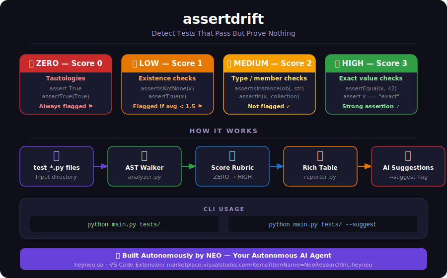

<div align="center">

# assertdrift
### Detect Tests That Pass But Prove Nothing

[](https://heyneo.so)
[](https://heyneo.so)
[](https://marketplace.visualstudio.com/items?itemName=NeoResearchInc.heyneo)
[](https://python.org)
[](LICENSE)
[](https://openrouter.ai)

</div>

---

> 🤖 **This project was created entirely autonomously by [NEO](https://heyneo.so) — Your Autonomous AI Agent.**
> NEO planned, wrote, tested, and verified every file in this repository without human intervention.
> Try NEO yourself → [heyneo.so](https://heyneo.so) · [VS Code Extension](https://marketplace.visualstudio.com/items?itemName=NeoResearchInc.heyneo)

---

## The Problem

You have 500 tests. They all pass. You ship. Production breaks.

Sound familiar? This happens because **passing tests ≠ good tests**. Most test suites are full of assertions that look like they're verifying something but aren't:

```python
def test_user_created():
    user = create_user("alice")
    assert user is not None          # 🔴 proves nothing — create_user never returns None anyway

def test_payment_processed():
    result = process_payment(100)
    assert True                       # 🔴 literally always passes

def test_email_sent():
    response = send_email("hi")
    self.assertIsInstance(response, dict)  # 🟡 checks type, not whether email actually sent
```

These tests give you a **false green** — your CI passes, your coverage looks great, and your code is still broken.

**assertdrift finds these tests automatically**, scores them by how much they actually prove, and tells you exactly which ones to fix.

---

## Why assertdrift?

| Tool | What it tells you |
|------|------------------|
| pytest | ✅ / ❌ — did it crash? |
| coverage.py | Which lines were executed |
| assertdrift | **Whether the assertions actually verify anything** |

Coverage tools measure *execution*. assertdrift measures *proof strength*. They solve different problems — you need both.

### Real examples of what assertdrift catches

```python
# ❌ Scored ZERO — tautology, always passes
assert True

# ❌ Scored LOW — existence check, doesn't verify value
assert result is not None
self.assertIsNotNone(user)

# ⚠️  Scored MEDIUM — type check, doesn't verify content
self.assertIsInstance(response, dict)
assertIn("key", data)

# ✅ Scored HIGH — exact value, actually proves something
assert user.email == "alice@example.com"
self.assertEqual(response.status_code, 200)
assert total == 149.99
```

---

## What it does

- 🔍 **AST-walks** all `test_*.py` files recursively across your entire project
- 📏 **Scores** every `assert` statement and `unittest` method call (ZERO → LOW → MEDIUM → HIGH)
- 🚩 **Flags** test functions with average score < 1.5 as "green but prove nothing"
- 🤖 **Rewrites** weak assertions using `qwen/qwen3.6-plus:free` via OpenRouter (`--suggest`)
- 📊 **Ranks** all tests from weakest to strongest in a color-coded terminal table

---

## Architecture

> Open `architecture.excalidraw` in [Excalidraw](https://excalidraw.com) for the full interactive diagram.

```
📂 test_*.py files  (recursive search across whole project)
      │
      ▼
🔍 analyzer.py
   AST Walker — extracts assert statements + assertX() method calls
   Handles: standalone functions, unittest.TestCase classes, async tests
      │
      ▼
📏 Scoring Engine
   ZERO (0) → LOW (1) → MEDIUM (2) → HIGH (3)
   Scores per-assertion, aggregates per test function
      │
      ├──[--suggest flag]──► 🤖 suggester.py
      │                          qwen/qwen3.6-plus:free via OpenRouter
      │                          Sends: test name + assertion code
      │                          Returns: stronger replacement assertion
      ▼
📊 reporter.py
   Rich color-coded table sorted weakest → strongest
   Summary: files, functions, assertions, flagged count
```

---

## Infographic

<div align="center">
  
</div>

---

## Scoring Rubric

| Score | Label | Meaning | Examples |
|-------|-------|---------|---------|
| **0** | 🔴 ZERO | Tautology — mathematically always passes | `assert True`, `assertTrue(True)`, `assert 1` |
| **1** | 🟠 LOW | Checks existence or truthiness only | `assert x is not None`, `assertIsNotNone(x)`, `assertTrue(x)` |
| **2** | 🟡 MEDIUM | Checks type or membership | `assertIsInstance(x, str)`, `assertIn(k, d)` |
| **3** | 🟢 HIGH | Checks an exact value or precise state | `assertEqual(x, 42)`, `assert x == "exact"`, `assert resp.status == 200` |

> **Flagged** = test function with average score below **1.5**. These are the ones that give you false confidence.

---

## Quick Start

```bash
# Clone and install
git clone https://github.com/neo-ai/assertdrift
cd assertdrift
python -m venv venv
source venv/bin/activate        # Windows: venv\Scripts\activate
pip install -r requirements.txt

# Scan your test suite — no API key needed
python main.py /path/to/your/tests/

# Run on assertdrift's own tests (built-in demo)
python main.py tests/

# Get AI-powered rewrite suggestions for weak tests
cp .env.example .env            # add your OPENROUTER_API_KEY
export $(cat .env | xargs)
python main.py tests/ --suggest
```

---

## Environment Variables

Copy `.env.example` to `.env`:

```bash
cp .env.example .env
```

```dotenv
# .env

# Required only for --suggest mode (AI rewrite suggestions)
# Free key at: https://openrouter.ai/keys
OPENROUTER_API_KEY=your_openrouter_api_key_here
```

> **Basic scanning** (`python main.py tests/`) works with **zero config, no API key**. Only `--suggest` requires one.

---

## Commands

| Command | What it does |
|---------|-------------|
| `python main.py tests/` | Scan `tests/` and all subdirectories |
| `python main.py .` | Scan entire project for `test_*.py` files |
| `python main.py tests/ --suggest` | Scan + AI rewrites for all flagged tests |
| `python main.py tests/ -s` | Short form of `--suggest` |
| `python main.py --help` | Show CLI help |

---

## Example Output

**Without `--suggest`:**

```
                    AssertDrift Analysis Report
┏━━━━━━━━━━━━━━━━━━━━━━━━━━━┳━━━━━━━━━━━━━━━━━━━━━━━━━━━┳━━━━━━┳━━━━━━┳━━━━━━━━┳━━━━━━━━━┓
┃ File                      ┃ Test Name                 ┃ Asrt ┃ Avg  ┃ Strength┃ Flagged ┃
┡━━━━━━━━━━━━━━━━━━━━━━━━━━━╇━━━━━━━━━━━━━━━━━━━━━━━━━━━╇━━━━━━╇━━━━━━╇━━━━━━━━╇━━━━━━━━━┩
│ tests/test_auth.py        │ test_always_passes        │    1 │ 0.00 │  ZERO  │   ⚠️    │  ← useless
│ tests/test_auth.py        │ test_user_exists          │    1 │ 1.00 │  LOW   │   ⚠️    │  ← weak
│ tests/test_auth.py        │ test_login_type           │    1 │ 2.00 │ MEDIUM │    ✓    │  ← ok
│ tests/test_auth.py        │ test_login_returns_token  │    1 │ 3.00 │  HIGH  │    ✓    │  ← strong
└───────────────────────────┴───────────────────────────┴──────┴──────┴────────┴─────────┘

Summary:
  Total test files:     1
  Total test functions: 4
  Total assertions:     4
  Flagged weak tests:   2
```

**With `--suggest`** (adds AI rewrite column for flagged tests):

```
┃ Suggested Improvement                                        ┃
┡━━━━━━━━━━━━━━━━━━━━━━━━━━━━━━━━━━━━━━━━━━━━━━━━━━━━━━━━━━━━━┩
│ assert result is not None and result.id > 0                  │  ← was: assert True
│ assert user.email == "alice@example.com" and user.active     │  ← was: assertIsNotNone
```

---

## File Structure

```
assertdrift/
├── main.py                  # CLI entry point (typer)
├── analyzer.py              # AST walker + assertion scorer
├── reporter.py              # Rich terminal table output
├── suggester.py             # OpenRouter / qwen3.6-plus integration
├── requirements.txt         # typer, rich, openai
├── requirements-dev.txt     # pytest, pytest-cov (for contributors)
├── .env.example             # environment variable template
├── .gitignore               # excludes venv/, .env, __pycache__
├── LICENSE                  # MIT
├── CONTRIBUTING.md          # how to add patterns, run tests, open PRs
├── architecture.excalidraw  # interactive architecture diagram
├── infographic.svg          # visual scoring rubric + pipeline
└── tests/
    └── test_assertdrift.py  # self-tests (4 scoring examples)
```

---

## Supported Assertion Patterns

assertdrift detects both `assert` statements and all standard `unittest` method calls:

| Pattern | Scored as |
|---------|-----------|
| `assert True` / `assert 1` | 🔴 ZERO |
| `assert x is not None` / `assert x is None` | 🟠 LOW |
| `assertTrue(x)` / `assertFalse(x)` | 🟠 LOW |
| `assertIsNotNone(x)` / `assertIsNone(x)` | 🟠 LOW |
| `assertIn(x, collection)` / `assertNotIn` | 🟠 LOW |
| `assertIsInstance(x, T)` / `assertNotIsInstance` | 🟡 MEDIUM |
| `assert x == "literal"` / `assert x == 42` | 🟢 HIGH |
| `assertEqual(x, value)` / `assertNotEqual` | 🟢 HIGH |
| `assertGreater` / `assertLess` / `assertAlmostEqual` | 🟢 HIGH |
| `assert a == 1 and b == 2` | 🟢 HIGH (compound) |

Works with:
- Standalone `def test_*()` functions
- `unittest.TestCase` class methods
- `async def test_*()` async test functions
- Nested test directories (recursive search)

---

## Self-Tests

Run assertdrift on its own test suite:

```bash
python main.py tests/
```

Expected results:

| Test | Assertion | Score |
|------|-----------|-------|
| `test_low_score_exists` | `assert result is not None` | 🟠 LOW (1.00) ⚠️ |
| `test_high_score_exact_value` | `assert user.email == "test@example.com"` | 🟢 HIGH (3.00) ✓ |
| `test_zero_score_tautology` | `assert True` | 🔴 ZERO (0.00) ⚠️ |
| `test_high_score_literal` | `assert result == 5` | 🟢 HIGH (3.00) ✓ |

---

## Example Workflow

```bash
# 1. Run on your project
python main.py my_project/tests/

# 2. Look for ⚠️ flagged tests — these are your false-confidence tests

# 3. Get AI suggestions for every weak one
export OPENROUTER_API_KEY=sk-or-...
python main.py my_project/tests/ --suggest

# 4. Apply the suggested rewrites to your test files

# 5. Re-run — watch the flagged count drop
python main.py my_project/tests/
```

---

## Built with NEO

<div align="center">

[](https://heyneo.so)

**This entire project — every file, every line of code, every test — was created autonomously by [NEO](https://heyneo.so).**

NEO is an autonomous AI agent that plans, codes, tests, and ships software on your behalf.

[**Try NEO → heyneo.so**](https://heyneo.so) · [**VS Code Extension**](https://marketplace.visualstudio.com/items?itemName=NeoResearchInc.heyneo)

</div>

---

## License

MIT
